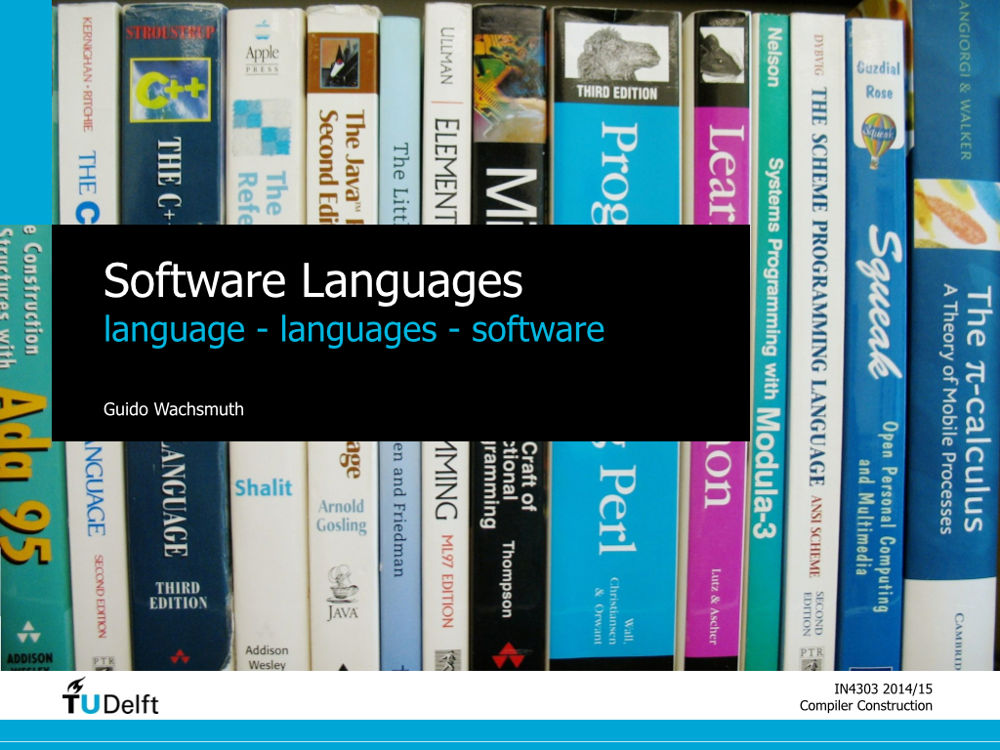

# Summary

This introduction lecture sets the scene for the course.
We introduce the notions of *software languages* and *language software* from a bigger, interdisciplinary picture. 

We start with a linguistic discussion of *language*, its properties, and the study of language in philosophy and linguistics.
We then investigate *natural languages*, *controlled languages*, and *artificial languages* to emphasise the human ability to control and construct languages.
At the end of the first part of the lecture, we arrive at the notion of *software languages* as means to communicate software between people.

In the second part of the lecture, we extend the notion of *software languages* as means to realise processes on machines.
We give an overview of *language software*, starting from *interpreters* and *compilers*.
We then introduce various *language processors* as basic building blocks of compilers.
We continue with a comparison of traditional compilers and modern compilers in IDEs. 
Finally, we introduce traditional *compiler compilers* and modern *language workbenches* as tools to construct compilers.

# Slides

 

# Further Reading

1. Edward Sapir (1921). Introductory: Language Defined. In [Language. An Introduction to the Study of Speech](http://www.gutenberg.org/files/12629/12629-h/12629-h.htm).

  This chapter provides a definition of *language* and explains properties of language.

2. [Ethnologue: Languages of the World](www.ethnologue.com)
 
  This is a comprehensive reference work cataloging all of the world’s known living languages. TH T

