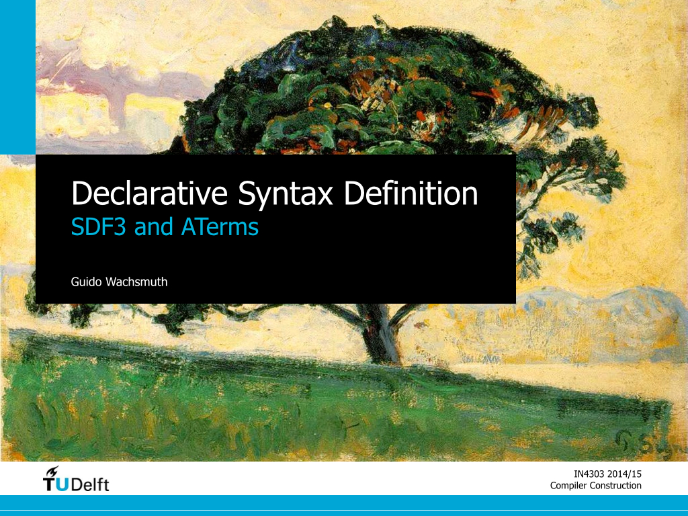
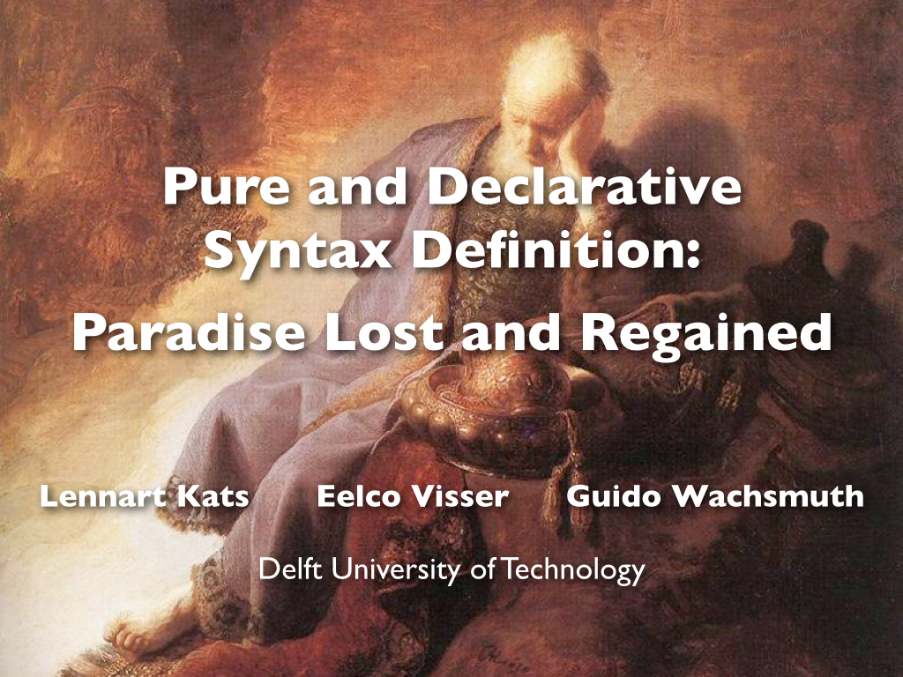

# Summary

* syntax definition
  * regular expressions
  * BNF
  * EBNF
* SDF3
  * lexical syntax
  * context-free syntax
  * abstract syntax
  * disambiguation
* Spoofax
  * architecture & meta-levels
  * testing
  * editors
* syntax-based language processing
  * parsing
  * pretty-printing
  * discovery
  * syntax highlighting, folding, outlining
  
# Slides

 

# Further Reading

1. Lennart C. L. Kats and Eelco Visser (2010). [The Spoofax Language Workbench. Rules for Declarative Specification of Languages and IDEs](http://swerl.tudelft.nl/twiki/pub/Main/TechnicalReports/TUD-SERG-2010-029.pdf). OOPSLA 2010.

  This award-winning paper describes the Spoofax Language Workbench. It misses recent additions to Spoofax, but still gives a good summary of its capabilities.
  
2. Lennart C. L. Kats, Rob Vermaas, and Eelco Visser (2011). [Integrated Language Definition Testing. Enabling Test-Driven Language Development](http://swerl.tudelft.nl/twiki/pub/Main/TechnicalReports/TUD-SERG-2010-029.pdf). OOPSLA 2011.

  This paper describes the Spoofax Testing Language and discusses how to test different language aspects. You can also watch the [conference talk by Lennart](http://www.infoq.com/presentations/Testing-Domain-Specific-Languages).

3. Jean-Marie Favre (2004). [Foundations of Meta-Pyramids: Languages vs. Metamodels-Episode II. Story of Thotus the Baboon](http://drops.dagstuhl.de/opus/volltexte/2005/21/pdf/04101.FavreJeanMarie.Paper.pdf). Dagstuhl Seminar 4101.

  This paper explores and explains various relations between languages, language definitions, and language instances. The paper includes examples from natural languages and focusses on modelling languages, meta-models, and models. It can be generalised to software languages, language definitions, and software artefacts.
  
4. Tobi Vollebregt, Lennart C. L. Kats, and Eelco Visser (2012). [Declarative Specification of Template-Based Textual Editors](http://www.lclnet.nl/publications/specification-of-template-based-editors.pdf). LDTA 2012.

  This paper summarises Tobi's [MSc thesis](http://repository.tudelft.nl/view/ir/uuid%3A8907468c-b102-4a35-aa84-d49bb2110541/) on syntax templates as means for declarative syntax definitions. It explains how parsers, formatters, and code completion templates can be derived from a single source.
  
5. Lennart C. L. Kats, Eelco Visser, and Guido Wachsmuth (2010). [Declarative Syntax Definition. Paradise Lost and Regained](http://swerl.tudelft.nl/twiki/pub/Main/TechnicalReports/TUD-SERG-2010-019.pdf). Onward! 2010.

  This essay emphasises the beauty of declarative syntax definitions and discusses the consequences of impure, non-declarative parser definitions.
  
