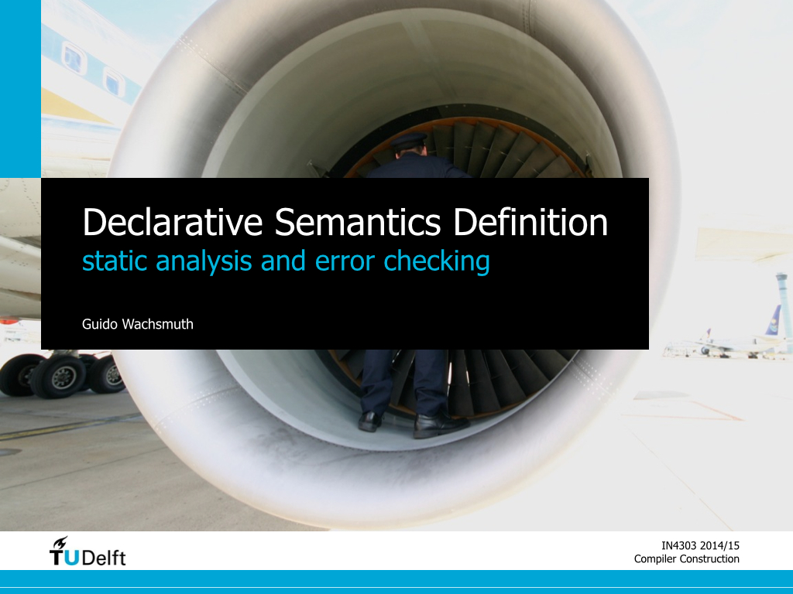

# Summary

* formal semantics
  * type system
  * name binding
* testing
  * name binding
  * type system
  * constraints
* specification
  * name binding (NaBL)
  * type system (TS)
  * constraints (TS)
  
# Slides

 

# Further Reading

1. Gabriël Konat, Lennart Kats, Guido Wachsmuth, and Eelco Visser (2013). [Declarative Name Binding and Scope Rules](http://repository.tudelft.nl/assets/uuid:ebf61531-bbdf-4bde-b991-7733d9ae4af4/TUD-SERG-2012-015.pdf). SLE 2012.

  This paper introduces the concepts of NaBL and explains them with C# as an example language.
  The syntax of NaBL has slightly changed over the last two years, but the core concepts are still the same.
  
2. Guido Wachsmuth, Gabriël Konat, Vlad Vergu, Danny Groenewegen, and Eelco Visser (2013). [A language independent task engine for incremental name and type analysis](http://swerl.tudelft.nl/twiki/pub/Main/TechnicalReports/TUD-SERG-2013-014.pdf). SLE 2013.

  This paper looks behind the scenes and explains how incremental name and type analysis is realised in Spoofax.
  
3. Eelco Visser, Guido Wachsmuth, Andrew Tolmach, Pierre Neron, Vlad Vergu, Augusto Passalaqua, and Gabriël Konat (2014). [A Language Designer's Workbench. A One-Stop-Shop for Implementation and Verification of Language Designs](http://web.cecs.pdx.edu/~apt/onward14.pdf). Onward! 2014.

  This paper promotes declarative language definitions as a single source for language implementation and verification.
  It presents a proof-of-concept language designer’s workbench that supports generation of IDEs, interpreters, and verification infrastructure from a single source. 
  This constitutes a first milestone on the way to a system that fully automates language implementation and verification.
