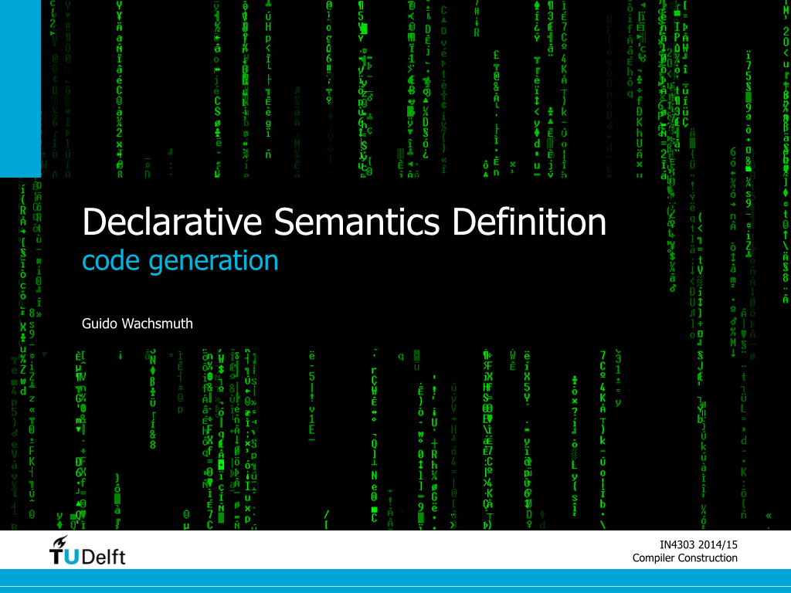

# Summary

* Java Virtual Machine
  * method area
  * operand stack
  * constant pool
  * local variables
  * heap
  * Java bytecode instructions
  * class files
* code generation techniques
  * printing strings
  * string concatenation
  * string interpolation
  * compilation by transformation
  * LLVM compiler infrastructure
* calling conventions
  * stack frames in the JVM
  * stack frames in register-based machines
  * CDECL
  * STDCALL
  * FASTCALL
  
# Slides

 

# Further Reading

Tim Lindholm, Frank Yellin, Gilad Bracha, and Alex Buckley (2013). (The Java Virtual Machine Specification)[http://docs.oracle.com/javase/specs/jvms/se7/html/].

Bill Venners (2000). Inside the Java 2 Virtual Machine. McGraw-Hill.

Zef Hemel, Lennart C. L. Kats, Danny M. Groenewegen, and Eelco Visser (2010). (Code generation by model transformation. A case study in transformation modularity)[http://dx.doi.org/10.1007/s10270-009-0136-1]. SoSym 9(3), Springer.
